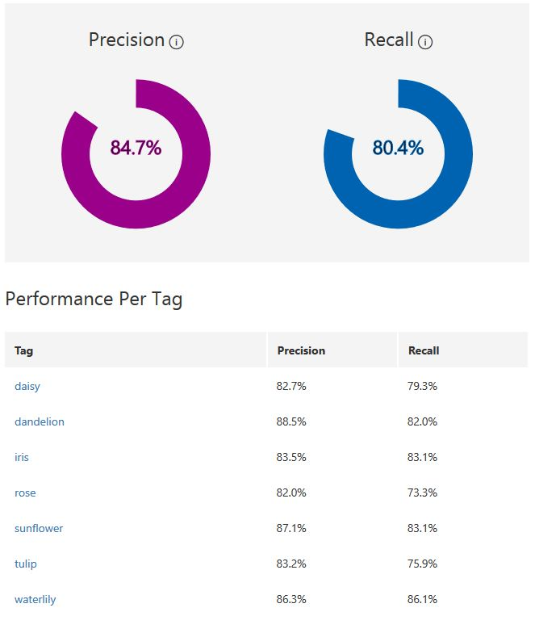
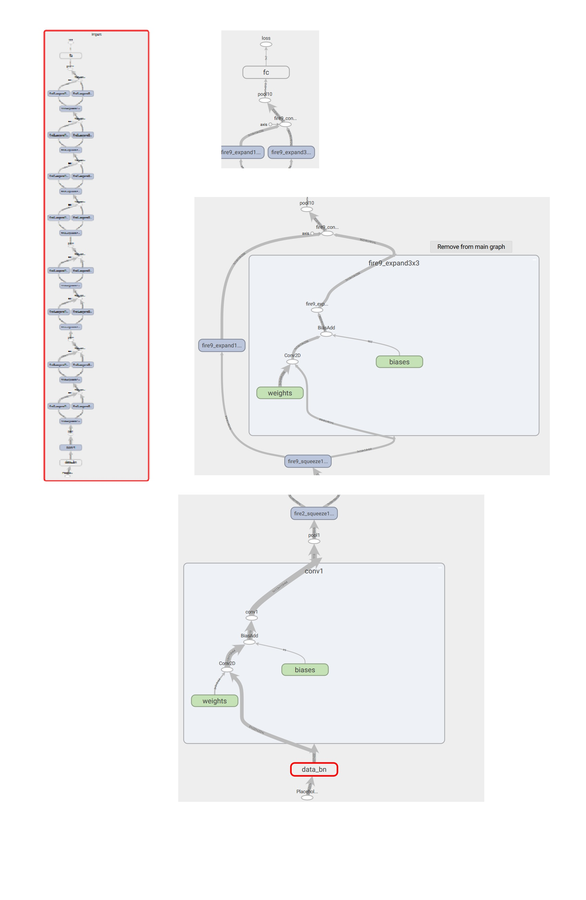

# Your Pocket botanist

## Table of Contents

**Project introduction**

- [Objective](#objective)
- [Datasets](#datasets)
- [Why Instagram?](#why-instagram?)
- [Is this a Flower?](#is-this-a-flower?)
- [Change of plan](#change-of-plan)

**Big experiments**

- [Getting a Tensorflow model](#getting-a-tensorflow-model)
- [Testing Tensorflow locally](#testing-tensorflow-locally)
- [Serverless AI](#serverless-ai)
- [Machine Learning JavaScript](#machine-learning-javaScript)
- [Black and White](#black-and-white)

**Testing Results**

- [Clarifai](#clarifai)
- [Tensorflow](#tensorflow)

**User Application**

- [VUE.JS](#vue.js)
- [Future progress](#future-progress)

**Learning and thoughts**

- [Abstraction](#abstraction)
- [Real intelligence](#real-intelligence)

## Project introduction

### Objective

The objective of this project is to build a ML model to recognise seven types of flowers in realtime with a singe page application(SPA).

### Datasets

As a training dataset for 5 classes, except for iris and waterlily, it has been used this dataset from kaggle.
[Kaggle dataset](https://www.kaggle.com/alxmamaev/flowers-recognition/data)

As already said I downloaded the remaining two classes photos from Instagram with [4k stogram](https://www.4kdownload.com/products/product-stogram).

Then after that I continued using this application to download images for the testing dataset.

**Classes:**

1.  daisy
2.  dandelion
3.  iris
4.  rose
5.  sunflower
6.  tulip
7.  waterlily

**Training Dataset:** 700 images each class

**Testing Dataset:** 50 images each class

### Why Instagram?

Instagram images were downloaded by looking at hashtag with name of the flower. This brought up many images that didn't have the flower in it cause people using the platform don't have to respect any control on hashtags.

I preferred using Instagram, not fetching simple google images or similiar things because I thought that Instagram photos are more aligned to what the end users are going to caputure with their phones using "Pocket Botanist" app. This experiment and its results will be discussed in the final part of this document.

### Clarifai

Before the start of "Cognitive Services" course I found out [Clarifai](https://www.clarifai.com/) a small company providing "The most personalized computer vision solution on the planet", in short terms a suite of API and web interface to build custom visual models.

At the beginning of this project I started testing them but I stopped developing a custom model because one problem aroused.

They won't provide any simple way to export your model, they profit by keeping you hooked to their services as almost every other big ML provider does such as Google or Amazon.

### Is this a flower?

I decided to use Clarifai services anyway for a single feature for the application I was going to build.

I used their [General Model](https://www.clarifai.com/models/general-image-recognition-model-aaa03c23b3724a16a56b629203edc62c) to predict if in a user photo there was a "plant" or a "flower" to prevent "wrong" images from getting in the queue for the real classification model.

This reduced the possibility of users submitting images of people, cars or any other thing except the area of this application.

### Change of plan

I decided that I wanted to use a service that would give me the possibility to export a model of some kind of format, being able to use it in any way I wanted in the future.

Looking at various solutions in the current market of ML softwares and tools I choose to work with Tensorflow saved models.

## Big experiments

With all those images I then needed to conduct various experiments to get a "Machine Learning system" capable of returning the approriated class for a flower.

### Getting a Tensorflow model

As previously said I want to train and create various Tensorflow models.
I choose two different sources:

- microsoft cognitive services [customvision.ai](http://customvision.ai/)
- tensorflow transfer learning through [retrain script](https://github.com/Giorat/pocketbotanist/blob/master/transfer_learning/retrain.py) from tensorflow team executed on [flodyhub.com](https://flodyhub.com)

Both of those two sources outputted two files:

- the Tensorflow Frozen Model as model.pb file, composed by the weights from the training and the neural network layout
- lables.txt file with the ordered list of classes name each one outputted from the model as a number associated to the class row in the txt file.

In the following sections I'll evalute each different method of training

#### Custom Vision

I discovered this service while looking at possible API or services that enabled fast tensorflow model training, with an export function.
This web software let's users train a model in less than 10 minutes getting pretty accurate predictions on different kind of areas/subjects.

Their output model need images to be translated from RGB color code to BGR(Blue-Green-Red) with a widthXheigh of 227 pixels.

This were the results at the end of the training:

Model layout

#### Flodyhub

Floydhub isn't a service provider of API or apps to train a machine learning visual model like customvision but it provides user with a fast and quick workbench in the cloud to train models using AWS CPU with up to 20 hours of free training time for new users.

I choose this service other than others such as Google Cloud services because with just one simple command I was able to start training a neural network with optimized Tensorflow kernel on my custom code and training dataset.

I trained two different models using a script from the Tensorflow Team:

- Inception V3, one of the most famous model built in the last few years
- Mobilenet V2, one of the new models type, focused on quick computations to run on mobile devices with a small footprint of the model (10 mb against 100mb or more, such as Inception 80mb, 8 times more )

The setting for the training were:

- 4,000 training steps
- 80% of the images into the main training set
- 10% of images aside to run as validation frequently during training
- final 10% of images that were used less often as a testing set to predict the real-world performance of the classifier
- learning rate of 0.01 when training
- traininig batch size 100
- validation batch size 100
- evaluation step interval of 10 eval
- testing batch size == entire dataset

Those were the results I got:

- **Inception V3**
  - [execution on floydhub](https://www.floydhub.com/riccardogiorato/projects/mobilenettraining/16)
    Step 3999: Train accuracy = 89.0%
    Step 3999: Cross entropy = 0.274404
    Step 3999: Validation accuracy = 82.0% (N=100)
- **Mobilenet V2**
  - [execution on floydhub](https://www.floydhub.com/riccardogiorato/projects/mobilenettraining/17)
    Step 3999: Train accuracy = 97.0%
    Step 3999: Cross entropy = 0.192044
    Step 3999: Validation accuracy = 80.0% (N=100)

### Testing Tensorflow locally

Having Tensorflow Frozen Models, I wanted to testout if the models were working locally on my machine.

### Serverless AI

I wanted to use Tensorflow as a serverless function in the cloud.
After some searches I found out many possible alternatives such as Google Cloud Functions, AWS lambda or Algorithmia functions.
I choose the last one cause they were the most focused on machine learning functions, with the simplest way to configure and run them.
Plus the give 5.000 credits each month for free where the other cloud providers only gave limited time trial credits.

The function code is [here](./algorithmia) and the function online can be seen [here](https://algorithmia.com/algorithms/riccardogiorato/yourPocketbotanist).

### Machine Learning JavaScript

Around February 2018 Google announced that a small project called deeplearn.js had been converted to TensorFlow.js the official supported version of TensorFlow as a library for training and deploying ML models in the browser and on Node.js.

One of it's proposed features it's the conversion of TensorFlow python model to run in the browser.
Up to now, June 2018, conversion it's not fully supported because many operations and methods still need to be translated/converted to Javascript.

Due to the fact that I wanted to be able to run the model without using the power of cloud, enabling the full user privacy of image analasysis I managed to export the model with [tfjs-converter](https://github.com/tensorflow/tfjs-converter) and then built a [Model Loader](https://github.com/Giorat/pocketbotanist/blob/master/js/src/machine_learning/ModelLoader.js).

In the final application I disabled this feature because I got wrong predictions due to the fact that many operations still lack of complete testing and the model ended up classifying almost every picture as a dandelion.

### Black and White

'turning images to black and white to remove bias?'
I have tested if removing colors from images might lead to a better model or worst.
I trained it using again custom-vision and this where the results I got.

They were 5/6% less accurate both in precision and in recall than the colored version model.

My conclusion is that even if colors might introduce some bias they are really helpfuel to recognise flowers even if the dataset need to provide different types.
For example, the training dataset provided different kind of rose colors even if it's common to see roses only as red, this enabled the model to recognise different kind of roses without being fooled by saying that anything red like a rose might be more probabable to be a rose.

## Testing Results

### Clarifai

Tested Clarifai general API to detect a flower on the testing dataset of 350 images.

| Flower found | Probability > 50 | Average Probability |
| ------------ | ---------------- | ------------------- |
| 318          | 318              | 0,984802079378047   |
| 91%          | 91%              | 98%                 |

To visualized the images not founded look at [the notebook](./testing-clarifai.ipynb) used for the testing.

### Tensorflow

| Model name/source | Top-1 | Top-5 | Size MB | Avg exec 1 image |
| ----------------- | ----- | ----- | ------- | ---------------- |
| Custom-Vision     | 52%   | 98%   | 3 MB    | 0.366s           |
| Mobilenet-V2      | 64%   | 96%   | 8 MB    | 0.899s           |
| Inception V3      | 66%   | 96%   | 80 MB   | 4.996s           |

**Stats and reports:**

- Top-1 accuracy is the conventional accuracy: the model answer (the one with highest probability) must be exactly the expected answer.
- Top-5 accuracy means that any of your model 5 highest probability answers must match the expected answer.

## User Application

### VUE.JS

### Future progress

## Learning and thoughts

### Abstraction

### Real intelligence