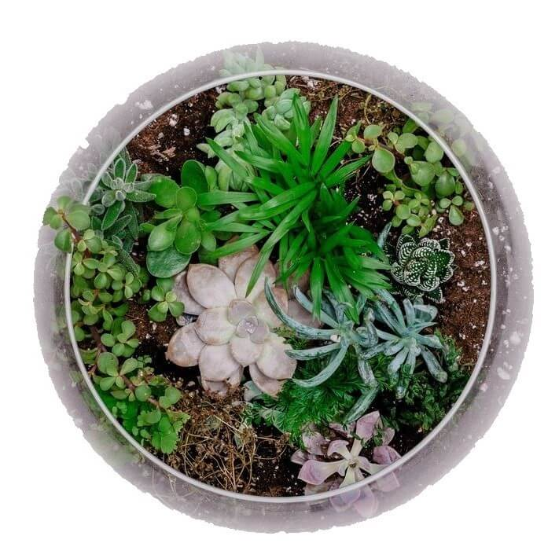
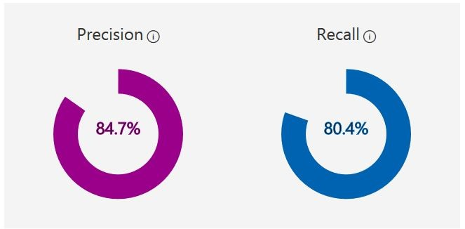
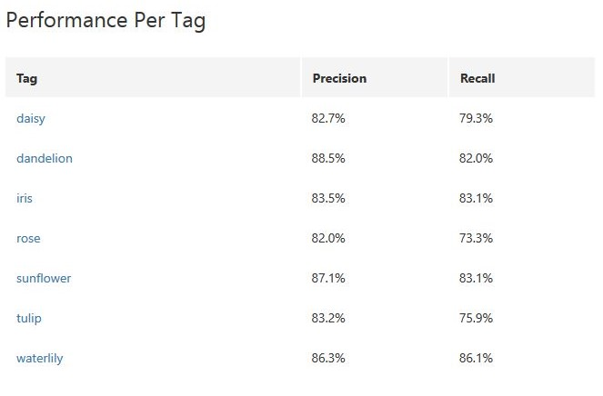
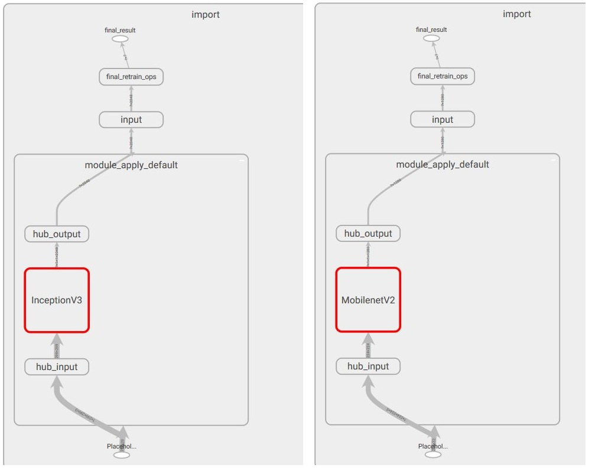
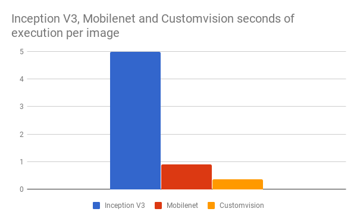
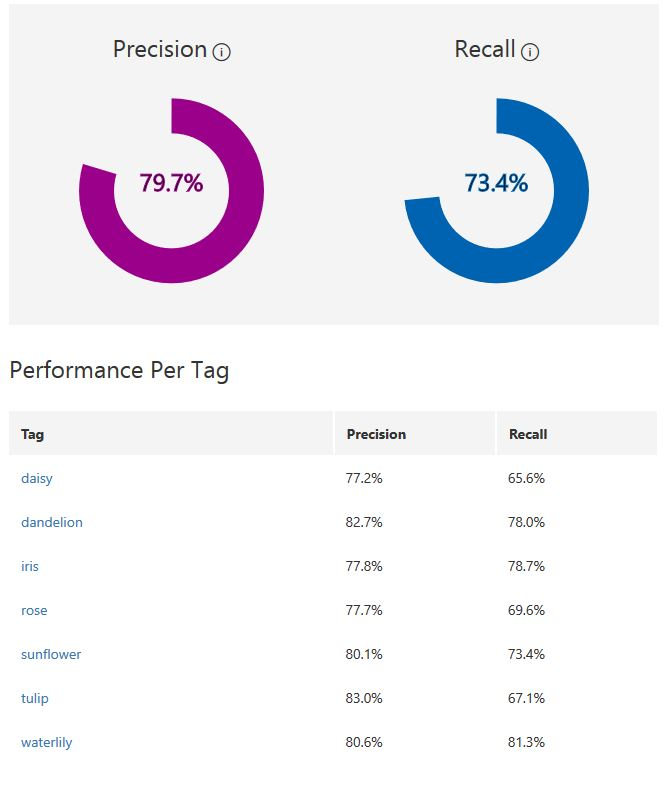

    

      

<h1 align="center"> Your Pocket botanist </h1>

<h3 align="center">
    Riccardo Emanuele Giorato - 1122158  
   Cognitive Services - Project type 2  
    Academic Year: 2017-2018
</h3>

   

"Botany is the science in which plants are known by their aliases."

 

## Table of Contents

- **Project introduction**
  - [Objective](#objective)
  - [Dataset](#dataset)
  - [Why Instagram](#why-instagram)
  - [Cognitive Services API problem](#cognitive-services-api-problem)
  - [Is this a Flower](#is-this-a-flower)
  - [Change of plan](#change-of-plan)

- **Big experiments**
  - [Getting a TensorFlow model](#getting-a-tensorflow-model)
  - [Testing TensorFlow locally](#testing-tensorflow-locally)

- **Testing Results**
  - [Clarifai](#clarifai)
  - [TensorFlow](#TensorFlow)
  - [The Chosen One](#the-chosen-one)

- **More experiments**
  - [Serverless AI](#serverless-ai)
  - [Machine Learning JavaScript](#machine-learning-javaScript)
  - [Black and White](#black-and-white)

- **User Application**
  - [VUE.JS](#vue.js)
  - [Future progress](#future-progress)

- **Learning and thoughts**
  - [Abstraction](#abstraction)
  - [Real intelligence](#real-intelligence)
  - [Conclusion](#conclusion)

 

## Project introduction

### Objective

The goal of this project is to build a ML visual model to recognize seven types of flowers in real time with a related web application.

In addition to that I'll discuss services and solutions that will enable to run this application in the future after the end of the project for free, it wouldn't be the same for services such as AWS that only give one year of free credits.

The entire project was developed posting all the progress, files and documents in this Github repository: [Giorat/pocketbotanist](https://github.com/Giorat/pocketbotanist).

The final web application can be found here: [pocketbotanist.ml](https://pocketbotanist.ml/).

### Dataset

The training dataset was made of 5 classes from this dataset on [Kaggle](https://www.kaggle.com/alxmamaev/flowers-recognition/data) plus 2 more, iris and waterlily that I downloaded from Instagram with [4k stogram](https://www.4kdownload.com/products/product-stogram) application.

I continued using this application to download images for the testing dataset too always from Instagram.

**Classes:**

1. daisy
2. dandelion
3. iris
4. rose
5. sunflower
6. tulip
7. waterlily

**Dataset size:** you can use easily get the two dataset used in this project from Floydhub:

- [Training image dataset](https://www.floydhub.com/riccardogiorato/datasets/pocketbotanist-training), 7 classes \* 700 images = 4900 total images
- [testing image dataset](https://www.floydhub.com/riccardogiorato/datasets/pocketbotanist-test), 7 classes \* 50 images = 350 total images

### Why Instagram

Instagram images were downloaded by looking at hashtag with name of the flower. This brought up many images that didn't have the flower in it cause people using the platform don't have to respect any rules on hashtags.

I preferred using Instagram, not fetching google images or similar ways because I thought that Instagram photos are more similar to what the end users are going to capture with their phones using "Pocket Botanist" app.

This source of images is also proved by this [new Research](https://www.theverge.com/2018/5/2/17311808/facebook-instagram-ai-training-hashtag-images) by Facebook where it's using billions of Instagram images to train models that were 1 to 2 percent better than any other system on the ImageNet benchmark.

### Cognitive Services API problem

Before the start of "Cognitive Services" course I found out [Clarifai](https://www.clarifai.com/) a small company providing quote:"The most personalized computer vision solution on the planet", in short terms a suite of API and web interfaces to build easily custom ML visual models.

At the beginning of this project I started testing them but I stopped using them because one problem aroused.

They won't provide any simple way to export your model, they profit by keeping you hooked to their services as almost every other big general ML provider does such as Google, Amazon or IBM.

### Is this a flower

I decided to use Clarifai services anyway for a single feature of the application I was going to build.

I used their [General Model](https://www.clarifai.com/models/general-image-recognition-model-aaa03c23b3724a16a56b629203edc62c) to predict if there was a "plant" or a "flower" in a user photo to prevent "wrong" images from getting in the queue for the real classification model.

This reduced the possibility of users submitting images of people, cars or any other thing except the area of this application, making the app react faster when user took photos of anything other that than flowers.

### Change of plan

My goals was to use a service that would give me the possibility to export a model in some kind of format, being able to use it in any way I wanted in the future.

I started looking at various solutions in the current market of ML softwares and tools, after some study I choose to work with TensorFlow saved models.

 

## Big experiments

### Getting a TensorFlow model

I wanted to train and create different TensorFlow models.
I choose two different sources:

- Microsoft Cognitive Services [Custom Vision](http://customvision.ai/)
- TensorFlow transfer learning through [retrain script](https://github.com/Giorat/pocketbotanist/blob/master/transfer_learning/retrain.py) from TensorFlow team executed on [flodyhub.com](https://flodyhub.com)

Both of those two sources outputted two really important files:

- the TensorFlow Frozen Model as **model.pb** file, composed by the weights from the training and the neural network layout
- **labels.txt** file with the ordered list of classes name each one outputted from the model as a number associated to the class row in the txt file.

In the following sections I'll evaluate each different method of training.

#### Custom Vision

I discovered this service while looking at possible API or services that enabled fast TensorFlow model training, with an export function.
This web software let's users train a model in less than 10 minutes getting pretty accurate predictions on different kind of areas/subjects.

Their output model need images to be translated from RGB color code to BGR(Blue-Green-Red) with a width X height of 227 pixels.

**Training results**

**Precision:** if a tag is predicted by your model, how likely is that to be right.

**Recall:** out of the tags which should be predicted correctly, what percentage did your model correctly find.

After studying the layout of the Frozen Model with TensorBoard, I was able to understand that Microsoft used SqueezeNet as base model to execute the transfer learning.

I'm sure of this because there were a bunch of ["fire modules"](https://arxiv.org/abs/1602.07360v3) in it and the layout was the same as described in [this  article about SqueezeNet](https://medium.com/@smallfishbigsea/notes-of-squeezenet-4137d51feef4).
Essentially SqueezeNet is a model with AlexNet-level accuracy with 50x fewer parameters and a model size of just a few MB.

**Model layout** 

#### Floydhub

Floydhub isn't a service provider of API or web apps to train a machine learning visual model like Custom Vision but it provides user with a fast and quick workbench in the cloud to train models using AWS CPU with up to 20 hours of free training time for new users.

I choose this service other than others such as Google Cloud services because with just one simple command I was able to start training a neural network with optimized TensorFlow kernel on my custom code and training dataset.

I trained two different models using a script from the TensorFlow Team:

- [Inception V3](https://arxiv.org/abs/1512.00567), one of the most famous model built in the last few years
- [MobileNetV2](https://arxiv.org/abs/1801.04381), one of the new models type, focused on quick computations to run on mobile devices with a small footprint of the model (10 MB against 100 MB or more, such as Inception 80 MB, 8 times more )

The setting for the training were:

- 4,000 training steps
- 80% of the images into the main training set
- 10% of images aside to run as validation frequently during training
- final 10% of images that were used less often as a testing set to predict the real-world performance of the classifier
- learning rate of 0.01 when training
- training batch size 100
- validation batch size 100
- evaluation step interval of 10 eval
- testing batch size == entire dataset

**Training results**

- **Inception V3:**
  - [execution on Floydhub](https://www.floydhub.com/riccardogiorato/projects/mobilenettraining/16)
    Step 3999: Train accuracy = 89.0%
    Step 3999: Cross entropy = 0.274404
    Step 3999: Validation accuracy = 82.0% (N=100)
- **MobileNetV2:**
  - [execution on Floydhub](https://www.floydhub.com/riccardogiorato/projects/mobilenettraining/17)
    Step 3999: Train accuracy = 97.0%
    Step 3999: Cross entropy = 0.192044
    Step 3999: Validation accuracy = 80.0% (N=100)

The model layout shares the input and output parts as it can be seen here from a TensorBoard screenshot fo the Frozen Models.

  

The only different was the block after hub_input and before hub_output.

**Inception V3 Model layout** 

**MobileNetV2 Model layout** 

### Testing TensorFlow locally

Having TensorFlow Frozen Models, I wanted to test out if the models were working locally on my machine.
Having used two sources for the models I merged the different steps to evaluate the images from:

- [Microsoft Azure running TensorFlow model from custom-vision in Python](https://docs.microsoft.com/en-us/azure/cognitive-services/custom-vision-service/export-model-python), image converted to smaller resolution then changed colors from RGB to BGR using numpy libraries;
- [official TensorFlow image label script after transfer learning](https://github.com/tensorflow/tensorflow/blob/master/tensorflow/examples/label_image/label_image.py), image resized to smaller resolution then converted using TensorFlow image functions.

I then used the resulting code from the merge of both script in [this jupyter notebook](https://github.com/Giorat/pocketbotanist/blob/master/python/testing-TensorFlow.ipynb).

**!! WARNING !!** This notebook is of 85 MB because it contains all the results from the models with the mismatched images of the flowers, used to get the results for the next section.

 

## Testing Results

### Clarifai

Tested Clarifai general API to detect a flower on the testing dataset.

| Flower found | Probability > 50 | Average Probability |
| ------------ | ---------------- | ------------------- |
| 318          | 318              | 0,984802079378047   |
| 91%          | 91%              | 98%                 |

To visualized the images not founded look at [the notebook](https://github.com/Giorat/pocketbotanist/blob/master/python/testing-clarifai.ipynb) used for the testing.

### TensorFlow

Tested TensorFlow models on the testing dataset, executed on laptop with intel i7 CPU and 8 GB of ram.

| Model name/source | Top-1 | Top-5 | Nodes | Size MB | Avg exec 1 image |
| ----------------- | ----- | ----- | ----- | ------- | ---------------- |
| Custom-Vision     | 52%   | 98%   | 152   | 3 MB    | 0.366s           |
| MobileNetV2       | 64%   | 96%   | 496   | 8 MB    | 0.899s           |
| Inception V3      | 66%   | 96%   | 687   | 80 MB   | 4.996s           |

**Stats and reports:**

- **Top-1** accuracy is the conventional accuracy: the model answer (the one with highest probability) must be exactly the expected answer.
- **Top-5** accuracy means that any of your model 5 highest probability answers must match the expected answer.

### The Chosen One

Before building the frontend app I had to choose which model to use in the Algorithmia function and with TensorFlow in Javascript.
Even if Inception V3 model was the most correct model in most of the cases I had to throw it away because it was too slow to get just a single prediction. With MobileNetV2 and Custom Vision remaining I choose Custom Vision because it was 3 times faster than MobileNetV2.

 

## More experiments

### Serverless AI

I wanted to use TensorFlow as a  [serverless function](https://medium.com/@BoweiHan/an-introduction-to-serverless-and-faas-functions-as-a-service-fb5cec0417b2) in the cloud.

I found out many possible alternatives such as Google Cloud Functions, AWS lambda or Algorithmia functions.
I choose the last one because they were the most focused on machine learning functions, with the simplest way to configure and run them.
Other than that, they give 5.000 free credits each month whereas the other cloud providers only gave limited time trial credits.

The function code is [here](https://github.com/Giorat/pocketbotanist/blob/master/python/algorithmia) and the function online can be seen [here](https://algorithmia.com/algorithms/riccardogiorato/yourPocketbotanist).

### Machine Learning JavaScript

Around February 2018 Google announced that a small project called deeplearn.js had been converted to [TensorFlow.js](https://js.tensorflow.org/) the official supported version of TensorFlow as a library for training and deploying ML models in the browser and on Node.js with Javascript.

One of its proposed features is the conversion of TensorFlow python model to run in the browser.
Up to now, June 2018, conversion it's not fully supported because many operations and methods still need to be translated/converted to Javascript.

Due to the fact that I wanted to be able to run the model without using the power of cloud, enabling the full user privacy of image analysis I managed to export the model with [tfjs-converter](https://github.com/TensorFlow/tfjs-converter) and then built a [Model Loader](https://github.com/Giorat/pocketbotanist/blob/master/js/src/machine_learning/ModelLoader.js).

In the final application I disabled this feature because I got wrong predictions due to the fact that many operations still lack of complete testing and the model ended up classifying almost every picture as a dandelion.

### Black and White

>"turning images to black and white to remove bias?"

I have tested if removing colors from images might lead to a better or worst model.
I trained it using again Custom Vision and this where the results I got.

They were 5/6% less accurate both in precision and in recall than the colored version model.

My conclusion is that even if colors might introduce some bias they are really helpful to recognize flowers even if the dataset need to provide different types.

For example, the training dataset provided different kind of rose colors even if it's common to see roses only as red, this enabled the model to recognize different kind of roses without being fooled by saying that anything red like a rose might be more probable to be a rose.

 

## User Application

### Vue.js

I choose [Vue.js](https://vuejs.org/), one of the current most famous open-source JavaScript framework for building user interfaces after React or Angular.

I developed the entire application as a Single Page Application([SPA](https://en.wikipedia.org/wiki/Single-page_application)), the app interacts with the user by dynamically changing the current page rather than loading entire new pages from a backend server. I also added various modules to help me out building it such as [vue-material](https://vuematerial.io/) to develop the UI and UX more easily.

**Pre-processing image**
One step really important in the evaluation of images by the TensorFlow model was the pre-processing of images, resizing them down to width and height equals to the network input size and even changing the order or color value array for custom-vision from RGB to BGR.
I decided to remove the python code from the backend function to reduce the cloud execution time, doing those steps on device with the help of HTML5 Canvas, as it can seen in the functions [here](https://github.com/Giorat/pocketbotanist/blob/master/js/src/components/AnalyzePhoto.vue#L144) with the functions:

- resizeImg256
- cropcenter
- RGBtoBGR
- blurCanvas

### Timing and execution of ML on request

There are three different timing for three actions the web application usually does:

1. **Clarifai General Model:** to check if there's a flower, 1-2 seconds;
2. **Algorithmia TensorFlow function:**  being a serverless function, the first time a user trigger a request after a long time to this server, it will require 6/7 seconds extra seconds to unfreeze the function. Without considering this boot up time, a series of request will be executed in 2/3 second per each image;
3. **Javascript TensorFlow:** the timing is different again here, when the user first open up the application, the application will download the Frozen Model converted to the javascript version in more or less 10 seconds after that, getting a prediction with the custom-vision model would take 3 seconds per each prediction on mobile and on desktop/laptop 2 seconds.

To sum up for each user photo, the app will take 2 seconds to understand if there's a flower, then in case there is, 3 more seconds to give back the specific predicted class.

### Future progress

As I already said I disabled the possibility to use local TensorFlow in the browser until the imported model are going to be fixed in the tfjs-converter.

 

## Learning and thoughts

### Abstraction

Using services such as custom-vision enabled a really high abstraction, even more than libraries such as Keras or TensorFlow Hub are useful but lack of the possibility to create quick experiments easily for everyone.

I also discovered similar services to custom-vision such as [Lobe](https://lobe.ai/) or [Automl](https://cloud.google.com/automl/), still closed to the open public, are going to enable greater experiences lowering the required entry level of knowledge to start working with Machine Learning models.

> "If AI really is going to change the world, then it seems obvious that the more people who get involved, the better — especially people outside the tech world." <cite> Mike Matas - co-founder of Lobe</cite>

Here's the link to a full [Lobe review](https://www.theverge.com/2018/6/12/17452742/deep-learning-ai-learn-lobe-made-easy-coding) by The Verge.

### Real intelligence

Another point of reflection is the real intelligence of those ML visual models.
I don't want to say that they aren't really clever even if the greatest models nowadays are getting really high accuracy while doing really specific tasks.

My thought is that even if humans might be less precise we tend to not do really drastic errors because we think about interesting related memories.

> “The state of the art in artificial intelligence today is merely a souped-up version of what machines could already do a generation ago: find hidden regularities in a large set of data. All the impressive achievements of deep learning amount to just curve fitting,”
<cite>[Judea Pearl](http://bayes.cs.ucla.edu/jp_home.html)</cite>

 From this article ["To Build Truly Intelligent Machines, Teach Them Cause and Effect"](https://www.quantamagazine.org/to-build-truly-intelligent-machines-teach-them-cause-and-effect-20180515/).

I have been thinking about Judea phrase and I started pondering about if teaching "Cause" and "Effect" might be even the to solution to teach a machine to recognize flowers.

I also want to reflect on the association of "Cause" and "Effect" with stories we create or tell everyday.

Let me explain if a children points a dandelion and ask you what's its name, you'll probably tell the answer but you won't stop there.
You might show them how a dandelion reacts when you blow some air on it. By doing that the children will be interested and curios, probably trying to imitate you as soon as possible looking at other plant trying to find another dandelion.

To sum up we tend to give children examples but we also provide interesting stories with cause and effect.

Many of those stories will disappear from our memory but some of them won't go away probably because there's the [proved link](https://en.wikipedia.org/wiki/Emotion_and_memory) between emotions and memory.

A machine might be built to be curious as a children, trying to recognize different object also by recalling some "interesting" stories from its memories.

### Conclusion

In summary, I was able to train a visual ML model using two different ways, choosing the Microsoft Custom Vision as the final one, running the exported TensorFlow model on a serverless services known as Algorithmia then I created a modern web application enabling users to get flower names just by taking a photo with their cameras.

The final TensorFlow model had a Top-1 precision of 52% and Top-5 precision of 98%, due to the fact that the testing dataset was too small to prove the full capability of it.

> "Why you need to improve your training/test dataset"
> <cite> by [Pete Warden](https://twitter.com/petewarden) from this [article](https://petewarden.com/2018/05/28/why-you-need-to-improve-your-training-data-and-how-to-do-it/) </cite>

If I had one more week I would have increased the testing dataset size 5 times more, in fact I tested out a smaller version of Tulip dataset with 100 new images always from Instagram getting Top-1 of 48% and a Top-5 of 93%, whereas the previous test got only Topi-1 of 30% and Top-5 of 90%.

This final test was completed in [this jupyter notebook](https://github.com/Giorat/pocketbotanist/blob/master/python/testing-more-tulip.ipynb).
