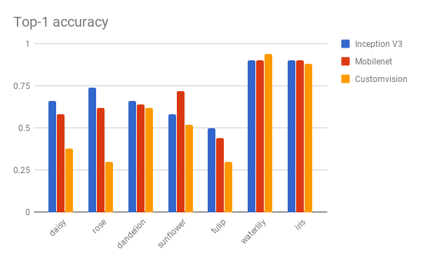

# Tensorflow and other experiments!

## Testing Models

### Datasets

**Classes:**

1.  daisy
2.  dandelion
3.  iris
4.  rose
5.  sunflower
6.  tulip
7.  waterlily

**Training Dataset:** 700 images each class

**Testing Dataset:** 50 images each class

### Clarifai 

Tested Clarifai general API to detect a flower on the testing dataset of 350 images.

| Flower found | Probability > 50 | Average Probability |
| ------------ | ---------------- | ------------------- |
| 318          | 318              | 0,984802079378047   |
| 91%          | 91%              | 98%                 |

To visualized the images not founded look at  [the notebook](./testing-clarifai.ipynb) used for the testing.

### Tensorflow

| Model name/source | Top-1 | Top-5 | Size MB | Avg exec 1 image |
| ----------------- | ----- | ----- | ------- | ---------------- |
| Custom-Vision     | 52%   | 98%   | 3 MB    | 0.366s           |
| Mobilenet-V2      | 64%   | 96%   | 8 MB    | 0.899s           |
| Inception V3      | 66%   | 96%   | 80 MB   | 4.996s           |

