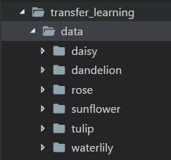

# Transfer Learning with TF and TF-HUB

### To train put in 'data' folder the Training images

## Running it locally

You can run it on your local machine with those untested steps:

1.  pip3 install -r floyd_requirements.txt
2.  python retrain.py --image_dir ./data/

## Running it in the Fastest FREE ML CLOUD

A better option is to run it in the "cloud" with Floydhub, it let's you train the network much faster using up to 20 free hours of training time.

### WARNING with this method without using Flodyhub data API the whole directory, this files and the copied images in data folder must weight less than 100MB!!

Their VM are hosted in AWS and can be easily launched with a simple CLI.

1.  register [here](https://www.floydhub.com/signup)
2.  install the CLI
    1.  Pyhton2: `pip install -U floyd-cli`
    2.  Pyhton3: `pip3 install -U floyd-cli`
3.  login on it with floyd login --token TOKEN_HERE copied from [here](https://www.floydhub.com/settings/security)
4.  initialize the current folder with your personal flodyd project with `floyd init`
5.  then run it with flody run command
    1.  transfer learning with InceptionV3: `floyd run --cpu --env tensorflow 'python retrain.py --image_dir ./data/'`
    2.  transfer learning with MobilenetV2: `floyd run --cpu --env tensorflow 'python retrain.py --image_dir ./data/ --architecture mobilenet_1.0_224 --tfhub_module https://tfhub.dev/google/imagenet/mobilenet_v2_100_224/feature_vector/1'`
6.  wait for your job on flodyhub to complete
7.  finally go to the output tab and download the resulting model
    1.  output_graph.pb
    2.  output_labels.txt

## Download those two files and enjoy your Tensorflow model anywhere you want!

You can use it on Algorithmia.com or port them to js.tensorflow.org